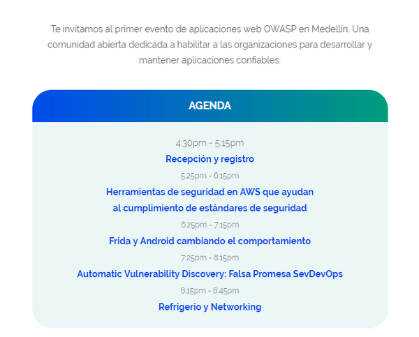
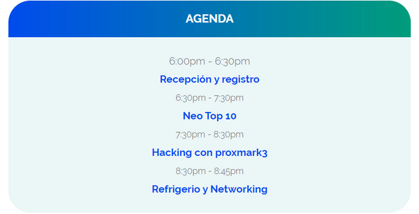

---

title: Comunidad
layout: null
tab: true
order: 3
tags: Medellin
---

# Resumen 2019

El 2019 fue un año muy importante para la comunidad, logramos revivir el capitulo y finalizamos el año con dos eventos.

## Primer Evento 2019 Evidencias
El primer evento fue un meetup donde tuvimos 3 charlas sobre seguridad informatica.

## Segundo Evento 2019 Evidencias
Invitacion en la cual se dio una charla sobre hacking con NFC.
